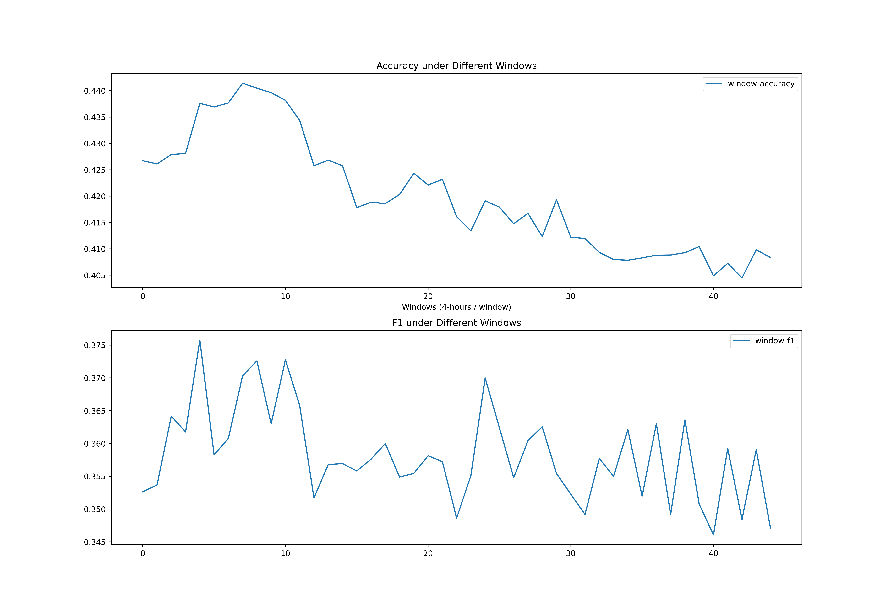
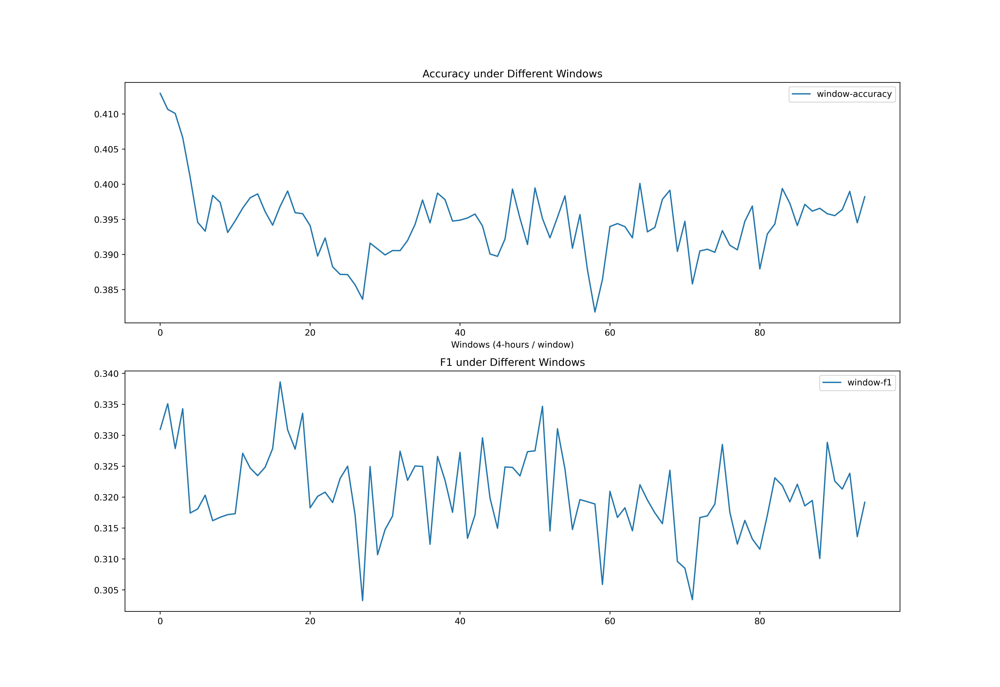
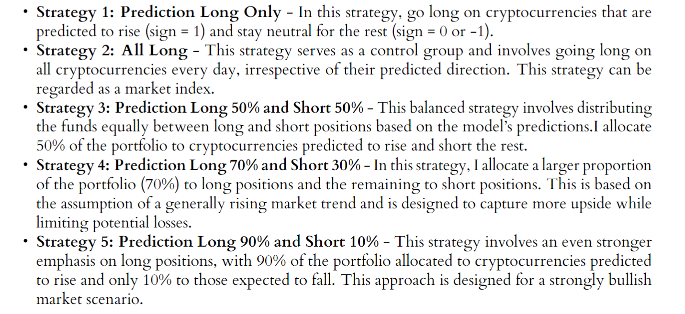
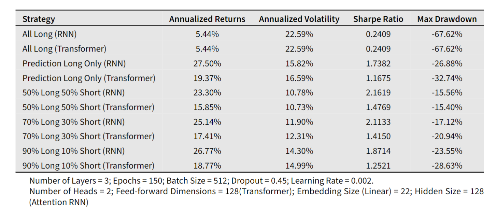
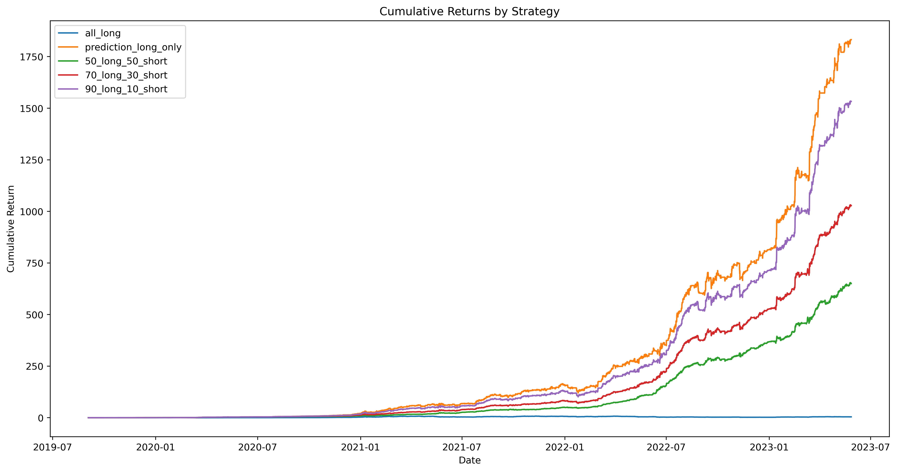
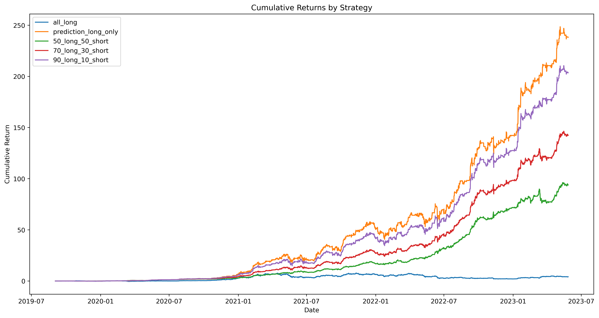

# Comparative Analysis of Deep Learning Models for Crypto Market Prediction
## Project URL
https://drive.google.com/file/d/1-DDE5hYiwn7tlwIAA_cf2tI9652c4sLa/view?usp=sharing
## Abstract 
This study investigates the performance of Attention Recurrent Neural Network (Attention RNN) and Transformer Encoder models for predicting cryptocurrency market movements as a classification problem using a hourly dataset of bitcoin and 7 4-hour features. Model performances are compared based onaccuracy and F1 macro scores, and the best-performing models are utilized to construct investment strategies evaluated by key metrics. Our findings demonstrate that the Attention RNN model outperforms the Transformer Encoder in this time-series prediction, highlighting its potential in quantitative finance for developing effective trading strategies in cryptocurrency markets.
## Window Size Effect
### Attention RNN

### Transformer Encoder

### Insights
#### Information gain often peaks at around using past 20 - 30 hours data and decreases with using more historical data.
## Results
### Strategies

### Strategy Results

### Cumulative Returns
Cumulative Returns for Different Strategy Returns

